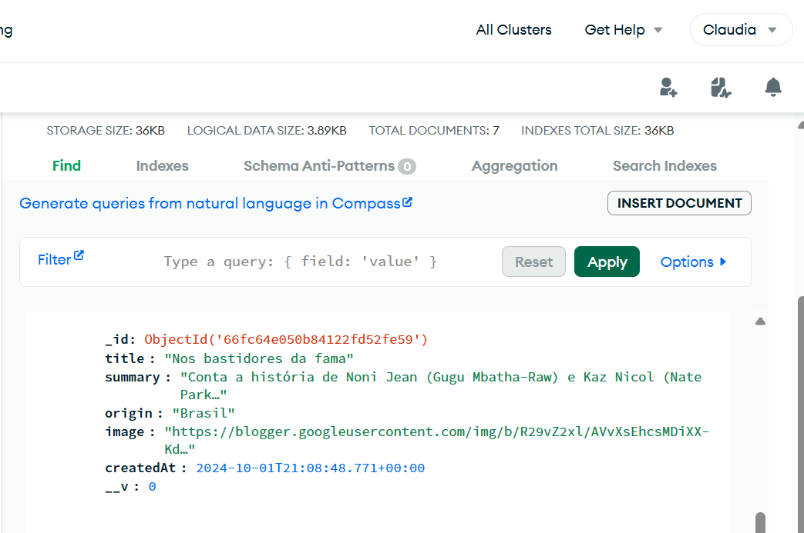

# Movies API

Este projeto é uma API para gerenciar filmes, onde é possível criar, listar, atualizar e deletar filmes. A API foi desenvolvida utilizando **Node.js**, **TypeScript** e **MongoDB**.

## Funcionalidades

- **Criar Filme:** Permite adicionar um novo filme à base de dados.
- **Listar Filmes:** Retorna todos os filmes cadastrados.
- **Listar Filme por ID:** Retorna um filme específico baseado no ID.
- **Atualizar Filme:** Permite atualizar os dados de um filme existente.
- **Deletar Filme:** Permite remover um filme da base de dados.

## Tecnologias Utilizadas

- **Node.js**
- **Express**
- **TypeScript**
- **MongoDB** com Mongoose
- **Insomnia** (para testar a API)

## Endpoints

### Criar Filme

- **POST** `/movies`
- Exemplo de corpo da requisição:

  ```json
  {
    "title": "Filme Exemplo",
    "summary": "Resumo do filme",
    "origin": "Origem do filme",
    "image": "URL da imagem do filme"
  }

### Listar Todos os Filmes

- **GET** `/movies`

### Listar Filme por ID

- **GET** `/movies/:id`

### Atualizar Filme

- **PUT** `/movies/:id`
- Exemplo de corpo da requisição:

  ```json
  {
    "title": "Novo Título",
    "summary": "Novo Resumo",
    "origin": "Nova Origem",
    "image": "Nova URL da Imagem"
  }

### Deletar Filme

- **DELETE** `/movies/:id`

## Prints do MongoDB

### POST


### GET


### UPDATE-ANTES


### UPDATE-DEPOIS


### DELETE


## Estrutura do Projeto

O projeto é estruturado seguindo os princípios da **Clean Architecture**, com a separação de responsabilidades, tornando-o mais escalável e fácil de manter. Abaixo está uma visão geral da estrutura de pastas:


```
src/
├── application/                        
│   ├── repositories/
│   │   └── movie-repository.ts           
│   │── use-cases/
│       ├── create-movie-use-case.ts     
│       │── delete-movie-use-case
│       ├── list-all-movies-use-case.ts  
│       ├── list-movie-by-id-use-case.ts 
│       └── update-movie-use-case.ts     
│
├── domain/                            
│   └── movie.ts                        
│
├── infrastructure/           
│   ├── database/
│   ├── mongo-db
│       └── connection.ts
│       └── model.ts 
│       └── repository.ts               
│   │── utils/
│       └── config.ts                   
│       └── id-generator.ts             
│
├── interface/                  
│   └── index.ts
│   └── movie-controller.ts     


Essa estrutura facilita o entendimento das responsabilidades de cada camada e módulo dentro do projeto.

---

Se precisar de mais ajustes ou quiser incluir mais detalhes sobre algum dos diretórios, é só me avisar!

